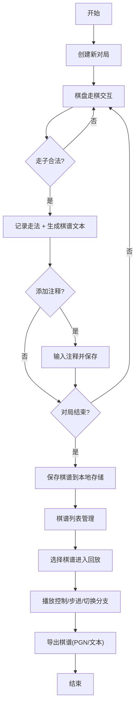

## 1. 产品概述

中国象棋棋谱记录与回放系统，面向象棋爱好者提供个人对局记录、棋谱管理、回放分析的完整工具链。用户可在标准棋盘上走棋，系统自动记录每一步为带注释的棋谱，支持随时回放、添加评论、管理分支变着，并可导出为常见棋谱格式。

- 解决传统纸质棋谱记录不便、难以回放分析的痛点
- 为象棋爱好者提供专业化、轻量化的棋谱研究工具

## 2. 核心功能

### 2.1 用户角色
| 角色 | 注册方式 | 核心权限 |
|------|---------|---------|
| 普通用户 | 无需注册，本地使用 | 创建、编辑、回放、导出棋谱 |

### 2.2 功能模块
1. **对局页面**: 标准中国象棋棋盘、棋子走棋交互、走法记录面板、实时注释输入
2. **棋谱列表页**: 所有本地棋谱列表、搜索筛选、删除、重命名、打开编辑
3. **回放面板**: 自动播放控制、速度调节、暂停/继续、分支变着切换、步级导航

### 2.3 页面详情
| 页面名称 | 模块名称 | 功能描述 |
|---------|---------|---------|
| 对局页面 | 棋盘区域 | 9×10标准象棋棋盘，点击棋子高亮可选落点，再次点击目标位置完成走棋 |
| 对局页面 | 走法记录面板 | 按步显示红黑方走法（如"炮二平五"），支持点击跳转、添加评论注释 |
| 对局页面 | 操作工具栏 | 新建对局、保存棋谱、悔棋、撤销、导出、切换回放模式 |
| 棋谱列表页 | 列表区域 | 卡片式展示棋谱标题、创建时间、步数、标签，支持搜索与排序 |
| 棋谱列表页 | 列表操作 | 打开棋谱、复制棋谱、删除棋谱、导入棋谱 |
| 回放面板 | 播放控制 | 播放/暂停、上一步/下一步、跳至首步/末步、播放速度（0.5x/1x/2x/4x） |
| 回放面板 | 分支管理 | 显示当前分支变着树，支持切换分支、在当前步添加新变着 |

## 3. 核心流程

用户创建新对局 → 在棋盘上依次走棋 → 系统自动记录每步走法与坐标 → 用户可随时为某步添加注释 → 对局结束后保存棋谱到本地 → 在列表中选择棋谱进入回放模式 → 自动播放或手动步进浏览 → 切换分支变着分析 → 导出为PGN或纯文本格式。

## 4. 用户界面设计

### 4.1 设计风格
- **主色调**: 深红木色 `#8B2500` 搭配米黄棋盘底色 `#F5DEB3`，营造传统实木棋盘氛围
- **辅助色**: 墨绿 `#2F4F2F` 用于功能按钮，金色 `#DAA520` 用于高亮与强调
- **字体**: 标题使用「思源宋体」体现古典韵味，正文使用「Noto Sans SC」确保可读性
- **按钮风格**: 圆角微立体按钮，悬停时轻微上浮，点击时凹陷反馈
- **布局风格**: 三栏式布局（左侧棋谱列表 + 中间棋盘主区 + 右侧走法记录与回放控制）
- **装饰风格**: 棋盘边线采用双线设计，棋子为圆形带立体阴影，楚河汉界使用古典书法字体

### 4.2 页面设计概述
| 页面名称 | 模块名称 | UI元素 |
|---------|---------|--------|
| 对局页面 | 棋盘区域 | 米黄色实木纹理背景、双线棋盘格、红黑立体圆形棋子、可选落点光晕提示、最后一步高亮标记 |
| 对局页面 | 走法记录面板 | 交替红黑底色的走法条目、步数序号、评论图标、当前步金色边框高亮 |
| 对局页面 | 操作工具栏 | 图标按钮组（新建/保存/悔棋/撤销/导出/回放切换）、悬停提示气泡 |
| 棋谱列表页 | 列表区域 | 卡片网格布局、棋谱缩略预览、标题+日期+步数元信息、操作按钮悬浮显示 |
| 回放面板 | 播放控制 | 进度条、播放/暂停大按钮、速度下拉选择、步进按钮组、变着树可视化 |

### 4.3 响应式
- 桌面端（默认）：三栏布局，棋盘居中占主要空间
- 平板端：左右侧面板可折叠收起，棋盘自适应缩放
- 移动端：单栏纵向布局，棋盘优先显示，面板通过底部标签页切换

### 4.4 动效设计
- 棋子移动：平滑平移过渡动画（300ms ease-out）
- 走法记录：新走法条目从右侧滑入并淡入
- 回放播放：当前步高亮脉冲动画
- 页面切换：淡入淡出过渡
