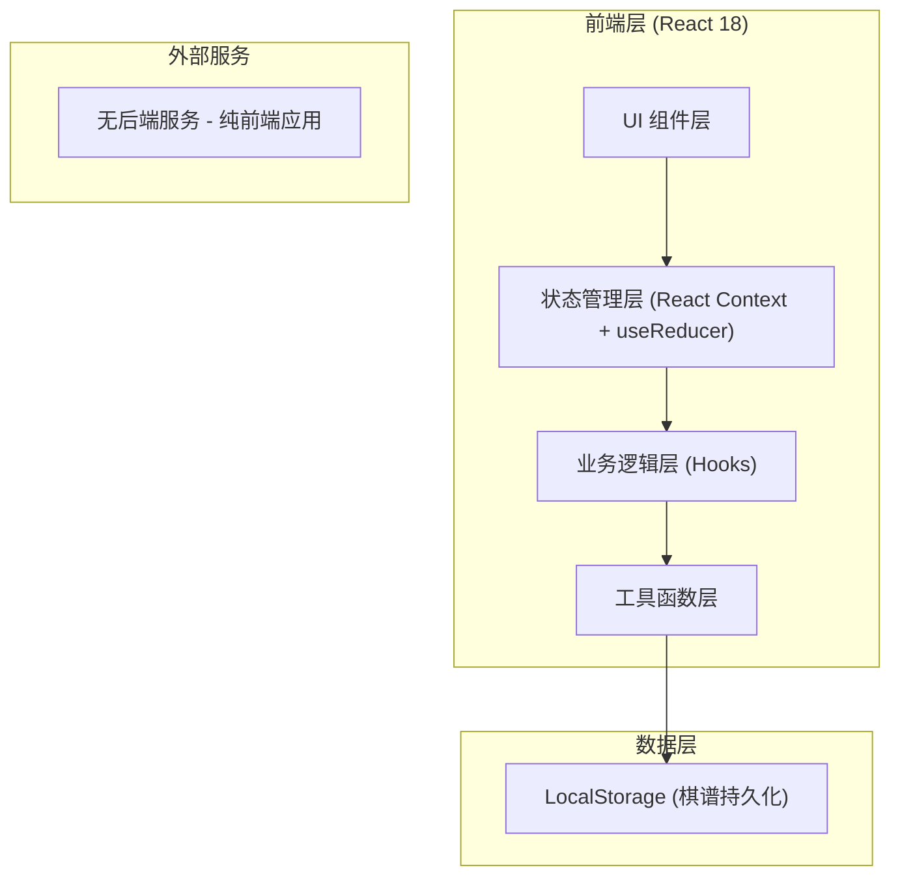
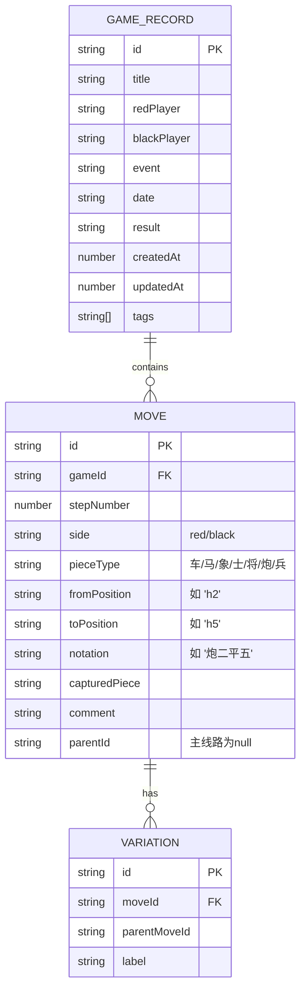

## 1. 架构设计



## 2. 技术描述
- **前端框架**: React@18 + TypeScript
- **构建工具**: Vite@5
- **样式方案**: TailwindCSS@3
- **状态管理**: React Context + useReducer (轻量级，无需引入 Redux)
- **本地存储**: Web LocalStorage API
- **路由**: React Router DOM@6
- **图标**: Lucide React (轻量级图标库)

## 3. 路由定义
| 路由 | 用途 |
|-----|------|
| `/` | 棋谱列表页 - 展示所有本地棋谱 |
| `/game/:id?` | 对局页面 - 棋盘走棋与记录 |
| `/replay/:id` | 回放页面 - 棋谱回放与变着分析 |

## 4. 数据模型

### 4.1 数据模型定义



### 4.2 TypeScript 类型定义

```typescript
// 棋子类型
type PieceType = '車' | '馬' | '象' | '士' | '將' | '砲' | '卒' | '车' | '马' | '相' | '仕' | '帅' | '炮' | '兵';
type Side = 'red' | 'black';

// 棋盘坐标 (0-8 列, 0-9 行)
interface Position {
  col: number;
  row: number;
}

// 棋子实例
interface Piece {
  id: string;
  type: PieceType;
  side: Side;
  position: Position;
}

// 单步走棋记录
interface Move {
  id: string;
  stepNumber: number;
  side: Side;
  pieceType: PieceType;
  from: Position;
  to: Position;
  notation: string;
  capturedPiece?: PieceType;
  comment?: string;
  parentMoveId?: string;
  variations?: Move[][];
}

// 棋谱记录
interface GameRecord {
  id: string;
  title: string;
  redPlayer: string;
  blackPlayer: string;
  event?: string;
  date?: string;
  result?: '红胜' | '黑胜' | '和棋' | '';
  createdAt: number;
  updatedAt: number;
  tags: string[];
  moves: Move[];
  initialBoard?: Piece[];
}

// 棋盘状态
interface BoardState {
  pieces: Piece[];
  currentSide: Side;
  moveHistory: Move[];
  currentMoveIndex: number;
  selectedPiece: Piece | null;
  validMoves: Position[];
  lastMove: { from: Position; to: Position } | null;
}
```

## 5. 核心模块划分

| 模块 | 文件路径 | 职责 |
|-----|---------|-----|
| 棋盘组件 | `src/components/Board/` | 渲染9×10棋盘、棋子、交互处理 |
| 走法记录 | `src/components/MoveList/` | 显示走法列表、注释编辑、跳转 |
| 回放控制 | `src/components/ReplayControls/` | 播放/暂停、速度、步进、分支切换 |
| 棋谱列表 | `src/components/GameList/` | 棋谱卡片、搜索、管理操作 |
| 工具函数 | `src/utils/chess.ts` | 走法合法性校验、棋谱记法生成、导出格式 |
| 状态管理 | `src/context/GameContext.tsx` | 全局游戏状态、棋盘状态、棋谱数据 |
| 本地存储 | `src/utils/storage.ts` | LocalStorage 读写封装 |
| 页面组件 | `src/pages/` | ListPage、GamePage、ReplayPage |

## 6. 核心算法说明

### 6.1 走法合法性校验
- 将/帅: 仅在九宫内直走一格，不能出九宫
- 士/仕: 仅在九宫内斜走一格
- 象/相: 走"田"字，不能过河，田字中心不能有子（塞象眼）
- 马: 走"日"字，前进方向一格不能有子（蹩马腿）
- 车: 横竖直走，不能越子
- 炮/砲: 行走同车，吃子需隔一子（炮架）
- 兵/卒: 过河前仅能向前，过河后可左右，不能后退
- 特殊规则: 将帅不能照面

### 6.2 中文记法生成（如"炮二平五"）
- 第一个字: 棋子名称
- 第二个字: 红方用汉字数字（一至九）从右往左数，黑方用阿拉伯数字（1-9）从左往右数，表起始列
- 第三个字: 进/退/平（向前/向后/平移）
- 第四个字: 目标列或进退步数

### 6.3 PGN 格式导出
采用类似国际象棋 PGN 的文本格式，包含标签对（[Event "..."]）和走法文本，使用中文数字记法。
